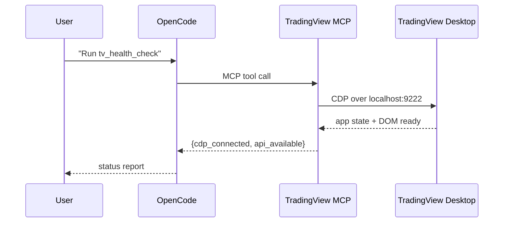
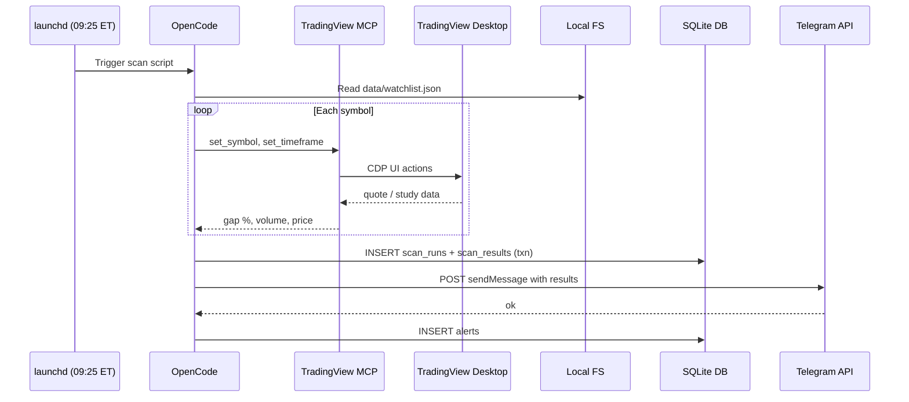
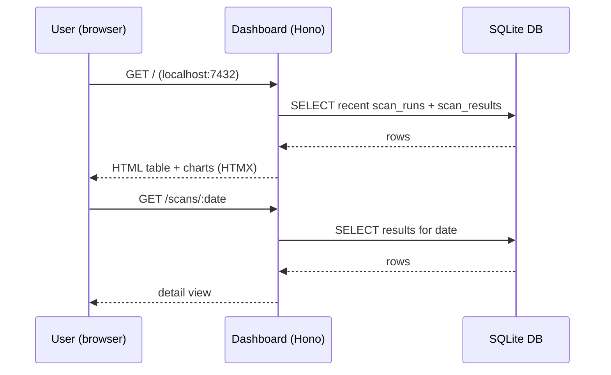
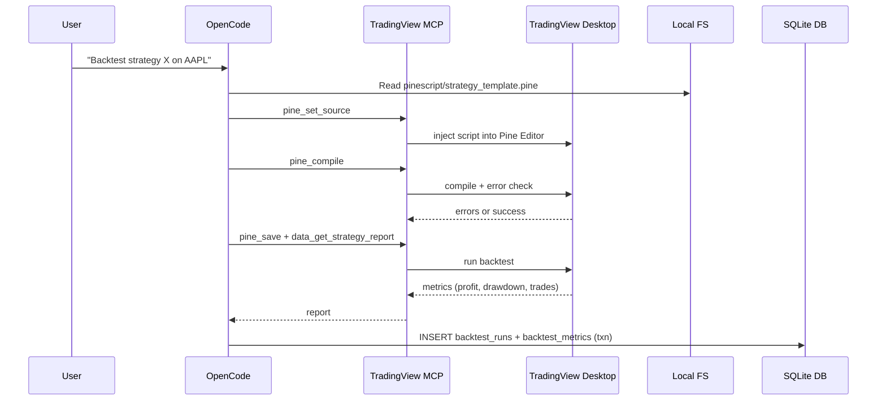

# OpenCode + TradingView MCP Trading Assistant — Plan

## 1. Executive Summary

Build a local, AI-assisted trading research pipeline on macOS. **OpenCode** drives TradingView Desktop via the open-source `tradesdontlie/tradingview-mcp` bridge (Chrome DevTools Protocol). The system scans premarket gappers, runs a strategy scanner, backtests setups in Pine Script, persists all results in **SQLite**, and surfaces them through a small local **web dashboard** plus Telegram alerts. **No trade execution** — TradingView does not hold broker credentials, so the blast radius is limited to research, alerts, and UI automation.

## 2. Goals & Non-Goals

### Goals
- Automate premarket gap scans from a defined watchlist.
- Run a post-open strategy scanner on the symbols produced by the gap scan.
- Backtest candidate setups using Pine Script inside TradingView.
- Persist scan results, backtests, alerts, and logs in SQLite for querying and historical analysis.
- Provide a local web dashboard to visualize scan results, trends, and backtest metrics.
- Send formatted alerts to Telegram.
- Keep everything local, version-controlled, and reproducible.

### Non-Goals
- No live order execution (no broker API, no TradingView broker integration).
- No cloud hosting or remote access in MVP — dashboard binds to `localhost` only.
- No prediction model training; this is rule-based scanning + AI-assisted scripting.
- No mobile TradingView support (Desktop app only).
- No multi-user auth on the dashboard (single local user).

## 3. High-Level Architecture

```
┌──────────────────────────────────────────────────────────────────────────┐
│                            User Machine (macOS)                          │
│                                                                          │
│  ┌──────────────┐      ┌─────────────────┐      ┌──────────────┐        │
│  │   OpenCode   │◄────►│ TradingView MCP │◄────►│ TradingView  │        │
│  │   (agent)    │      │    Server       │      │   Desktop    │        │
│  └──────┬───────┘      └─────────────────┘      └──────────────┘        │
│         │                                                                │
│         │ reads/writes                                                    │
│         ▼                                                                │
│  ┌──────────────────────────────┐        ┌───────────────────────────┐  │
│  │     Local Workspace          │        │   Dashboard Web App       │  │
│  │  - scan scripts (Node)       │        │  - Hono server (Node)     │  │
│  │  - watchlists (JSON)         │ read   │  - HTMX + Tailwind +      │  │
│  │  - Pine Script templates     │◄───────┤    Chart.js / uPlot       │  │
│  │  - .env (gitignored)         │        │  - binds to localhost     │  │
│  │  - SQLite DB (bot-trader.db) │        └───────────────────────────┘  │
│  └──────────────────────────────┘                                       │
│         │                                                                │
│         │ HTTPS API calls                                                │
│         ▼                                                                │
│  ┌──────────────┐                                                        │
│  │   Telegram   │  ← alerts to phone                                     │
│  │    Bot API   │                                                        │
│  └──────────────┘                                                        │
└──────────────────────────────────────────────────────────────────────────┘
```

### Components

| Component | Role | Notes |
|-----------|------|-------|
| **OpenCode** | Orchestrator. Interprets plain-English goals and invokes MCP tools. | Runs locally; loads MCP config on startup. |
| **TradingView MCP Server** | Bridge. Translates agent requests into CDP commands against TradingView Desktop. | Open source, Node.js, cloned to `~/tradingview-mcp`. |
| **TradingView Desktop** | Charting/data source. Must run with `--remote-debugging-port=9222`. | Paid subscription required for real-time data. |
| **Local Workspace** | Stores scripts, config, Pine Script, env vars, and the SQLite database. | This repo. |
| **SQLite DB** | Single-file store for scan runs, results, alerts, logs, backtests. | `data/bot-trader.db`; queried by scripts and the dashboard. |
| **Dashboard Web App** | Local-only UI to browse scans, trends, and backtest metrics. | Hono + HTMX + Tailwind + a charting lib; binds to `127.0.0.1`. |
| **Telegram Bot API** | Alert channel. Receives `curl` calls with formatted messages. | Bot token + chat ID stored in `.env`. |
| **Scheduler** | Triggers scans at market times. | `launchd` plist on macOS (preferred over cron for wake/sleep). |

## 4. Tech Stack

| Layer | Choice | Rationale |
|-------|--------|-----------|
| OS | macOS | Native TradingView Desktop app + CDP support works best here per community reports. |
| Runtime | Node.js 18+ + Python 3.11+ | Node is required by TradingView MCP, SQLite migration glue, and the dashboard; Python is used for the premarket gappers scanner because scraping/parsing workflows are simpler there. |
| Agent | OpenCode | Loads MCP servers and drives the workflow through chat. |
| Package Manager | `pnpm` for Node; Python stdlib first | `pnpm` remains the package manager for Node projects. The MVP scanner should prefer Python's standard library (`urllib`, `html.parser`/regex, `sqlite3`) before adding Python package tooling. |
| Bridge | `tradesdontlie/tradingview-mcp` | Open-source MCP server for TradingView Desktop. |
| Database | SQLite via `better-sqlite3` | Single-file, queryable, no separate server, atomic transactions, easy backups. |
| Dashboard Backend | Hono | Minimal, fast, works on plain Node; tiny dependency footprint. |
| Dashboard Frontend | HTMX + Tailwind (CDN) + Chart.js/uPlot | Server-rendered HTML with light interactivity; no SPA build step needed for a small dashboard. |
| Scripting | Python + Shell + Node.js | The premarket gappers scanner is Python; Node remains for MCP-adjacent glue, migrations, and the dashboard. |
| Scheduling | `launchd` plists | macOS-native, reliable across sleep/wake, logs to `~/Library/Logs`. |
| Secrets | `.env` file, gitignored | Telegram token, chat ID, debug port, watchlist defaults. |
| Notifications | Telegram Bot API (`sendMessage`) | Free, simple, mobile-friendly. |
| Version Control | Git | Track scripts, prompts, Pine Script, plists; exclude DB, results, logs, secrets. |

## 5. MVP Scope

The MVP proves the end-to-end loop without over-engineering.

### MVP Deliverables
1. **Connection layer** done
   - TradingView Desktop launches with CDP port 9222.
   - MCP server registered in OpenCode config (`opencode.json`).
   - `tv_health_check` returns `cdp_connected: true` and `api_available: true`.

2. **Scanner A: Premarket Gap Scan**
   - Input: a static watchlist file (`data/watchlist.json`).
   - Criteria: gap up ≥ 3%, premarket volume ≥ 300K, price ≥ $2 (configurable).
   - Output: rows inserted into SQLite `scan_runs` + `scan_results` tables.
   - Frequency: once at 09:25 ET (configurable).

3. **Telegram alert for Scanner A**
   - Send one formatted message per run with top results.
   - Log the alert in the `alerts` table.

4. **Observability**
   - Every scan writes a timestamped row to `scan_runs`.
   - Errors are captured in the `logs` table and optionally alerted.

### Out of MVP
- Scanner B (strategy scanner) and Pine Script backtesting loop.
- Dynamic watchlist management via MCP.
- Screenshot capture in alerts.
- Advanced scheduling (multiple intraday runs).

## 6. Data Flows

### Flow 1: Health Check / Connection



### Flow 2: Premarket Gap Scan (MVP)



### Flow 3: Dashboard Reads



### Flow 4: Pine Script Backtest (Post-MVP)



## 7. SQLite Schema

All durable runtime data lives in a single SQLite file: `data/bot-trader.db`. Config files (watchlists, scanner rules) remain JSON for easy hand-editing. `better-sqlite3` is used from Node.js; the schema is managed by a small migration script.

### Core Tables

```sql
CREATE TABLE scan_runs (
    id INTEGER PRIMARY KEY AUTOINCREMENT,
    scanner_name TEXT NOT NULL,
    run_at DATETIME DEFAULT CURRENT_TIMESTAMP,
    watchlist TEXT,
    criteria TEXT,
    status TEXT NOT NULL, -- 'success' | 'error' | 'empty'
    error_message TEXT
);

CREATE TABLE scan_results (
    id INTEGER PRIMARY KEY AUTOINCREMENT,
    scan_run_id INTEGER NOT NULL REFERENCES scan_runs(id) ON DELETE CASCADE,
    symbol TEXT NOT NULL,
    gap_pct REAL,
    premarket_volume INTEGER,
    price REAL,
    timeframe TEXT,
    metadata TEXT -- JSON blob for extra fields
);

CREATE TABLE alerts (
    id INTEGER PRIMARY KEY AUTOINCREMENT,
    scan_run_id INTEGER REFERENCES scan_runs(id) ON DELETE SET NULL,
    channel TEXT NOT NULL, -- 'telegram'
    sent_at DATETIME DEFAULT CURRENT_TIMESTAMP,
    payload TEXT NOT NULL,
    status TEXT NOT NULL, -- 'sent' | 'failed'
    error_message TEXT
);

CREATE TABLE logs (
    id INTEGER PRIMARY KEY AUTOINCREMENT,
    level TEXT NOT NULL,
    source TEXT NOT NULL,
    message TEXT NOT NULL,
    created_at DATETIME DEFAULT CURRENT_TIMESTAMP
);

CREATE TABLE backtest_runs (
    id INTEGER PRIMARY KEY AUTOINCREMENT,
    symbol TEXT NOT NULL,
    strategy_name TEXT NOT NULL,
    run_at DATETIME DEFAULT CURRENT_TIMESTAMP,
    pine_script TEXT,
    status TEXT NOT NULL
);

CREATE TABLE backtest_metrics (
    id INTEGER PRIMARY KEY AUTOINCREMENT,
    backtest_run_id INTEGER NOT NULL REFERENCES backtest_runs(id) ON DELETE CASCADE,
    metric_name TEXT NOT NULL,
    metric_value REAL
);
```

### Why SQLite

- **Queryable history.** Ask "show me all gappers over 5% from the last 20 sessions" without parsing files.
- **Single file.** Easy to back up, copy, and inspect with any SQLite client.
- **No extra service.** No Docker container or background daemon to manage.
- **Atomic writes.** A scan run and its results are inserted in one transaction.
- **Shared reader.** Both scan scripts and the dashboard read the same file.

## 8. Dashboard

A small local web app to visualize what's in the database — no auth, no cloud, binds to `127.0.0.1` only.

### Pages / Views
- **Overview** — latest scan run summary, top gappers today, alert status.
- **Scans** — table of historical `scan_runs` with drill-down to per-symbol `scan_results`.
- **Trends** — chart of gap % or hit frequency over time (Chart.js or uPlot).
- **Backtests** (Phase 4) — list of backtest runs with key metrics (win rate, profit factor, max drawdown).
- **Logs** — recent error/warn entries from the `logs` table for debugging.

### Tech Approach
- **Backend:** Hono serving HTML fragments + JSON endpoints, reading `better-sqlite3` directly.
- **Frontend:** server-rendered HTML with HTMX for partial reloads, Tailwind (CDN) for styling, Chart.js or uPlot for charts. No SPA build step — keeps the surface area tiny.
- **Binding:** `127.0.0.1:7432` (configurable). Never exposed to the network.
- **Run:** `pnpm dev` from `dashboard/`; optionally a second `launchd` plist to keep it running.

### Security Notes
- Dashboard is read-only against the DB (no write endpoints in MVP).
- Localhost binding only; do not port-forward or expose via ngrok without adding auth.
- The DB file is gitignored; the dashboard never serves the raw file, only rendered views.

## 9. OpenCode MCP Configuration

OpenCode supports MCP servers. The TradingView MCP server is a stdio-based local server, so it can be wired into OpenCode’s config alongside built-in tools.

### Recommended config (`opencode.json`)

```json
{
  "$schema": "https://opencode.ai/config.json",
  "mcpServers": {
    "tradingview": {
      "type": "stdio",
      "command": "node",
      "args": [
        "/Users/ed/tradingview-mcp/src/server.js"
      ],
      "env": []
    }
  }
}
```

Replace `/Users/ed/tradingview-mcp` with the actual clone path.

### Legacy/alternative format

Some OpenCode versions use the `mcp` key with `type: "local"` and a single `command` array:

```json
{
  "$schema": "https://opencode.ai/config.json",
  "mcp": {
    "tradingview": {
      "type": "local",
      "command": [
        "node",
        "/Users/ed/tradingview-mcp/src/server.js"
      ],
      "enabled": true
    }
  }
}
```

Use whichever format your OpenCode build validates. Tool identifiers will be prefixed with the server name, e.g., `tradingview_tv_health_check`.

## 10. Security & Risk Model

### Threats & Mitigations

| Threat | Likelihood | Impact | Mitigation |
|--------|------------|--------|------------|
| TradingView update breaks CDP selectors | High (over months) | Automation stops | Pin a working Desktop version; keep MCP server updated; maintain fallback manual prompts. |
| MCP over-permissioned / rogue UI actions | Low-Medium | Unwanted alerts, data leakage, account flags | Run OpenCode with least-privilege; review every MCP tool before approving writes/deletes; start read-only. |
| Dashboard exposed to network | Low | Data leakage | Bind to `127.0.0.1` only; no port forwarding; add auth before any remote access. |
| Telegram token leaked | Low | Spam/bot abuse | Store in `.env`; never commit; rotate if exposed. |
| Local machine compromise | Low | Full local access | Standard device security; no broker credentials on TradingView limits financial damage. |
| Data loss / missed alerts | Medium | Missed trades | Version-control scripts; log every run; alert on scanner failure, not just results; back up the DB file. |

### Guardrails
- **No execution.** No broker API keys, no TradingView trading panel integration.
- **Read-heavy first.** Only grant write/click permissions after validating behavior.
- **Secrets isolation.** `.env` is gitignored; plists load env from file, not inline.
- **Audit trail.** Every MCP-driven action and scan result is logged in SQLite.
- **Local-only dashboard.** Read-only, localhost-bound, no auth in MVP.

## 11. Roadmap

### Phase 0 — Foundation (Week 1)
- [ ] Install Node.js 18+ and `pnpm`.
- [ ] Install OpenCode.
- [ ] Clone `tradesdontlie/tradingview-mcp` and run `pnpm install`.
- [ ] Register MCP server in `opencode.json` (project-level).
- [ ] Launch TradingView with `--remote-debugging-port=9222`.
- [ ] Verify `tv_health_check` returns healthy.
- [ ] Initialize this repo with `.gitignore`, `README.md`, and `docs/`.

### Phase 1 — MVP Scanner + SQLite (Week 1-2)
- [ ] Create `data/watchlist.json` with a small test list (5-10 symbols).
- [ ] Define gap-scan criteria in `config/scanner.json`.
- [ ] Add `better-sqlite3` dependency and `scripts/migrate.js` to create schema.
- [ ] Build `scripts/scanner-premarket.py` as the premarket gappers scanner.
- [ ] Insert scan results into `data/bot-trader.db` (scan_runs + scan_results in one txn).
- [ ] Create Telegram bot; add token/chat ID to `.env`.
- [ ] Add alert formatting and send on every Scanner A run; log to `alerts` table.
- [ ] Add `launchd` plist to run at 09:25 ET on market days.

### Phase 2 — Dashboard (Week 2-3)
- [ ] Scaffold `dashboard/` with Hono + pnpm.
- [ ] Wire `better-sqlite3` read queries (recent scans, per-date drill-down).
- [ ] Build Overview and Scans pages with HTMX + Tailwind.
- [ ] Add a simple Trends chart (gap % over time) with Chart.js or uPlot.
- [ ] Bind to `127.0.0.1:7432`; add `pnpm dev` script.
- [ ] Optional: `launchd` plist to keep the dashboard running.

### Phase 3 — Strategy Scanner (Week 3-4)
- [ ] Read Scanner A output (from SQLite) and feed symbols into Scanner B.
- [ ] Define strategy rules (e.g., opening range breakout, VWAP reclaim).
- [ ] Run Scanner B post-open (e.g., 09:35–15:30 ET at 5-min intervals).
- [ ] Deduplicate alerts: notify only on new hits per day.

### Phase 4 — Backtest Loop (Week 4-5)
- [ ] Create Pine Script templates in `pinescript/`.
- [ ] Build a prompt/workflow for OpenCode to edit, compile, and save Pine Script via MCP.
- [ ] Capture strategy tester results and insert into `backtest_runs` + `backtest_metrics`.
- [ ] Add a Backtests view to the dashboard with key metrics.

### Phase 5 — Hardening & UX (Week 5+)
- [ ] Add comprehensive logging and failure alerts (scan didn’t run, TV disconnected).
- [ ] Add unit tests for pure logic (filtering, formatting, DB queries).
- [ ] Document runbook for recovery when TradingView updates break the bridge.
- [ ] Add DB backup routine (e.g., nightly copy of `bot-trader.db`).
- [ ] Evaluate whether to migrate scheduler to a more robust runner (e.g., `pm2`, `nix` flake, or Docker for reproducibility).

## 12. Directory Layout (Target)

```
~/Projects/bot-trader/
├── README.md
├── .gitignore
├── .env.example
├── opencode.json
├── package.json
├── pnpm-lock.yaml
├── config/
│   └── scanner.json
├── data/
│   ├── watchlist.json
│   └── bot-trader.db          # gitignored
├── logs/                      # gitignored (legacy/fallback)
├── pinescript/
│   └── strategy_template.pine
├── scripts/
│   ├── migrate.js
│   ├── scanner-premarket.py
│   └── notify-telegram.js
├── dashboard/
│   ├── index.ts               # Hono server
│   ├── queries.js             # SQLite read queries
│   ├── views/                 # HTML fragments
│   └── public/                # CSS/JS assets
├── launchd/
│   ├── com.bottrader.premarket.plist
│   └── com.bottrader.dashboard.plist
└── docs/
    └── plan.md
```

## 13. Open Questions

1. What is the exact gap-scan criteria? (e.g., % gap, min price, min volume, max float)
2. Which watchlist should Scanner A start with? (manual JSON, or pull from TradingView watchlist via MCP?)
3. What timezone should the scheduler use? (Eastern is assumed for US equities.)
4. Do you want screenshots in Telegram alerts? (Adds complexity but improves signal clarity.)
5. Should failures (e.g., TradingView not running) also go to Telegram?
6. Do you want to version-control the MCP server fork, or treat it as an external dependency?
7. Dashboard charts: Chart.js (easier, broader) or uPlot (faster, smaller)? Leaning Chart.js for a small dashboard.
8. Should the dashboard eventually write (e.g., mark a scan result as "watched" / "traded")? Keep read-only for MVP, but plan the schema with a `notes`/`status` column if so.

---

*Next step: review this plan, answer the open questions, and proceed to Phase 0 implementation if approved.*
