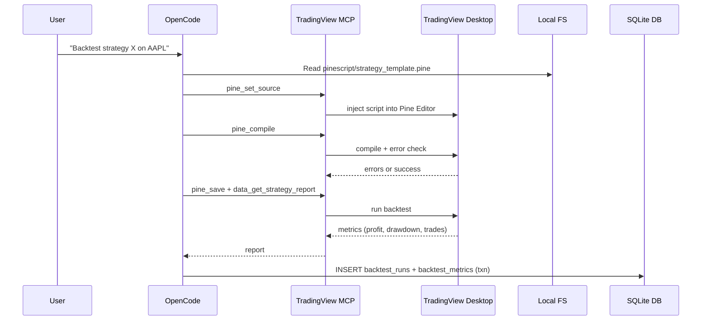

# OpenCode + TradingView MCP Trading Assistant — Plan


## 3. High-Level Architecture

```
┌──────────────────────────────────────────────────────────────────────────┐
│                            User Machine (macOS)                          │
│                                                                          │
│  ┌──────────────┐      ┌─────────────────┐      ┌──────────────┐        │
│  │   OpenCode   │◄────►│ TradingView MCP │◄────►│ TradingView  │        │
│  │   (agent)    │      │    Server       │      │   Desktop    │        │
│  └──────┬───────┘      └─────────────────┘      └──────────────┘        │
│         │                                                                │
│         │ reads/writes                                                    │
│         ▼                                                                │
│  ┌──────────────────────────────┐        ┌───────────────────────────┐  │
│  │     Local Workspace          │        │   Dashboard Web App       │  │
│  │  - scan scripts (Python)     │        │  - Hono server (Node)     │  │
│  │                              │ read   │  - HTMX + Tailwind +      │  │
│  │  - Pine Script templates     │◄───────┤    Chart.js / uPlot       │  │
│  │  - .env (gitignored)         │        │  - binds to localhost     │  │
│  │  - SQLite DB (bot-trader.db) │        └───────────────────────────┘  │
│  └──────────────────────────────┘                                       │
│         │                                                                │
│         │ HTTPS API calls                                                │
│         ▼                                                                │
│  ┌──────────────┐                                                        │
│  │   Telegram   │  ← alerts to phone                                     │
│  │    Bot API   │                                                        │
│  └──────────────┘                                                        │
└──────────────────────────────────────────────────────────────────────────┘
```

### Pine Script Backtest



## 7. SQLite Schema

single SQLite file: `data/bot-trader.db`. 


## 8. Dashboard

A small local web app to visualize what's in the database — no auth, no cloud, binds to `127.0.0.1` only.

## Recommended config (`opencode.json`)

```json
{
  "$schema": "https://opencode.ai/config.json",
  "mcpServers": {
    "tradingview": {
      "type": "stdio",
      "command": "node",
      "args": [
        "/Users/ed/tradingview-mcp/src/server.js"
      ],
      "env": []
    }
  }
}
```

Replace `/Users/ed/tradingview-mcp` with the actual clone path.

### Legacy/alternative format

Some OpenCode versions use the `mcp` key with `type: "local"` and a single `command` array:

```json
{
  "$schema": "https://opencode.ai/config.json",
  "mcp": {
    "tradingview": {
      "type": "local",
      "command": [
        "node",
        "/Users/ed/tradingview-mcp/src/server.js"
      ],
      "enabled": true
    }
  }
}
```

Use whichever format your OpenCode build validates. Tool identifiers will be prefixed with the server name, e.g., `tradingview_tv_health_check`.


## 12. Directory Layout (proposed)

```
~/Projects/bot-trader/
├── README.md
├── .gitignore
├── .env.example
├── opencode.json
├── package.json
├── pnpm-lock.yaml
├── config/
│   └── scanner.json
├── data/
│   ├── watchlist.json
│   └── bot-trader.db          # gitignored
├── logs/                      # gitignored (legacy/fallback)
├── pinescript/
│   └── strategy_template.pine
├── scripts/
│   ├── migrate.js
│   ├── scanner-premarket.py
│   └── notify-telegram.js
├── dashboard/
│   ├── index.ts               # Hono server
│   ├── queries.js             # SQLite read queries
│   ├── views/                 # HTML fragments
│   └── public/                # CSS/JS assets
├── launchd/
│   ├── com.bottrader.premarket.plist
│   └── com.bottrader.dashboard.plist
└── docs/
    └── plan.md
```

## 13. Open Questions

1. What is the exact gap-scan criteria? 15min
2. Dashboard charts: Chart.js (easier, broader) or uPlot (faster, smaller)? Leaning Chart.js for a small dashboard.


---

*Next step: review this plan, answer the open questions, and proceed to Phase 0 implementation if approved.*
